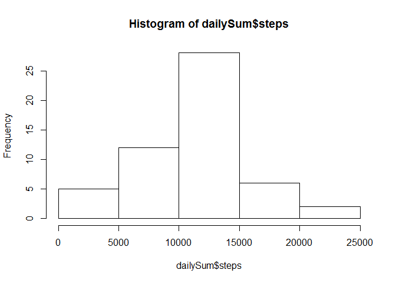
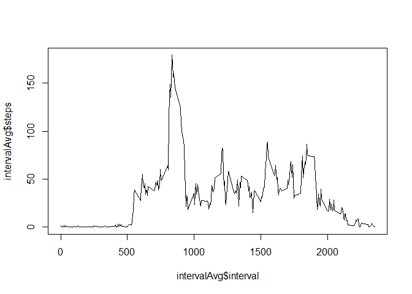
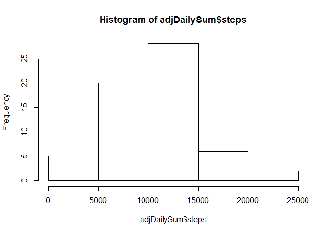
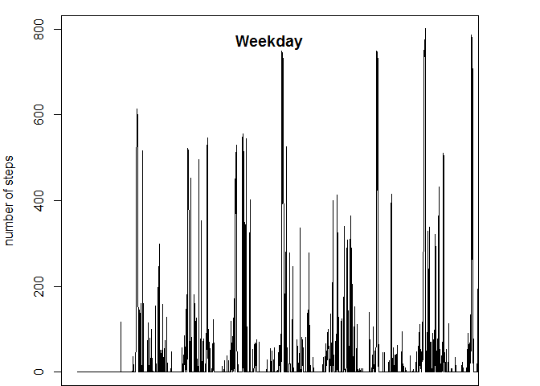
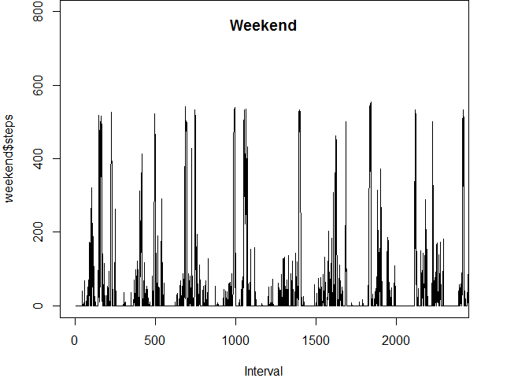

# Reproducible Research: Peer Assessment 1

##Loading and Preprocessing the data
First we load the data, (this script is working under the assumption that the Markdown file is in the same directory as the data).

```r
library(plyr)
data <- read.csv("activity.csv")
```
##What is mean total number of steps taken per day?
Then in order to determine the mean total of steps per day we utilize the plyr package to calcute the sum of steps by day and create a histogram.

```r
dailySum <- ddply(na.omit(data),c("date"),summarize,steps=sum(steps))

hist(dailySum$steps)
```

 

Additionally we calculate the mean and median values of the sum vector, which gives us the following values:

```r
mean(dailySum$steps)
```

```
## [1] 10766.19
```

```r
median(dailySum$steps)
```

```
## [1] 10765
```
##What is the average daily activity pattern?

In order to determine the daily activity pattern we will create a line plot showing the average number of steps for each 5 minute interval.  First however, we will replace the NA values in the data set with 0s in order to not nullify the calculations:

```r
tdata <- data
tdata[is.na(tdata)] <- 0
```
Then we will utilize the plyr package to average out the steps for each five minute interval across days and then plot this as a line chart.

```r
intervalAvg <- ddply(tdata, c("interval"),summarize,steps=mean(steps))
plot(intervalAvg$interval, intervalAvg$steps, type="l")
```

 

There is a clear maximum in the data set however it is unclear from the graph where it sits.  So we will call the summary function to determine the actual value of the maximum. 

```r
summary(intervalAvg)
```

```
##     interval          steps       
##  Min.   :   0.0   Min.   :  0.00  
##  1st Qu.: 588.8   1st Qu.:  2.16  
##  Median :1177.5   Median : 29.64  
##  Mean   :1177.5   Mean   : 32.48  
##  3rd Qu.:1766.2   3rd Qu.: 45.91  
##  Max.   :2355.0   Max.   :179.13
```
Which gives us 179.13, and to find the interval we simply take that result and compare it to the full dataset.  I used a greater or equal than as opposed to an equals since there is a chance of rounding off the full value and equality would not have caught that.


```r
subset(intervalAvg, steps>=179.13)
```

```
##     interval    steps
## 104      835 179.1311
```
Which gives us a value of 835 for the interval with the maximum value.

##Inputing missing values
As mentioned before the data set does contain several NA values.  The question is how do we address this?  First we should know how many NA values are in the dataset.  We are only going to worry about NA values for steps since the other columns are descriptive.

```r
sum(is.na(data$steps))
```

```
## [1] 2304
```
Additionally, we need to devise a method to fill these missing values.  For the purpose of this exercise I will fill the NA values with the mean for the corresponding 5 minute interval.  We then sum the values by day and create a histogram.

```r
odata <- subset(data, !is.na(steps))
ndata <- subset(data, is.na(steps))
for (i in unique(ndata$interval)) {
    r <- subset(data, is.na(steps))
    r <- subset(r, interval==i)
    
    r$steps[] <- as.numeric(subset(intervalAvg,interval==i,select=c("steps")))
    odata <- rbind(odata,r)
}

adjDailySum <- ddply(na.omit(odata),c("date"),summarize,steps=sum(steps))
hist(adjDailySum$steps)
```

 
While the histogram seems to be the same taking the median and mean show an alteration of the values.  Each value is lowered by a few thousand steps. 

```r
mean(adjDailySum$steps)
```

```
## [1] 10581.01
```

```r
median(adjDailySum$steps)
```

```
## [1] 10395
```
##Are there differences in activity patterns between weekdays and weekends?
To determine if there are differences between weekends and weekdays with respect to steps per day we first need to modify the data set to reflect whether a day falls into the week or the weekend.

```r
odata$Weekday <- weekdays(as.Date(odata$date))
weekday <- subset(odata, Weekday=="Monday"|Weekday=="Tuesday"|
              Weekday=="Wednesday"|Weekday=="Thursday"|Weekday=="Friday")
weekday$class <- 'weekday'

weekend <- subset(odata,Weekday=="Saturday"|Weekday=="Sunday")
weekend$class <- 'weekend'
```
We then set up a panel plot to track the differences

```r
par(mfcol=c(1,1))
par(mar=c(0,4,1,4))
plot(weekday$steps,xlim=c(0,2355),type="l",ylim=c(0,800),xaxt="n",xlab="",ylab="number of steps")
title("Weekday", line = -2)
par(mar=c(4,4,0,4))
plot(weekend$steps,xlim=c(0,2355),type="l",ylim=c(0,800),xlab="Interval")
title("Weekend", line=-2)
```
  

According to this plot it does seem that there are differences in activity between weekends and weekdays.
